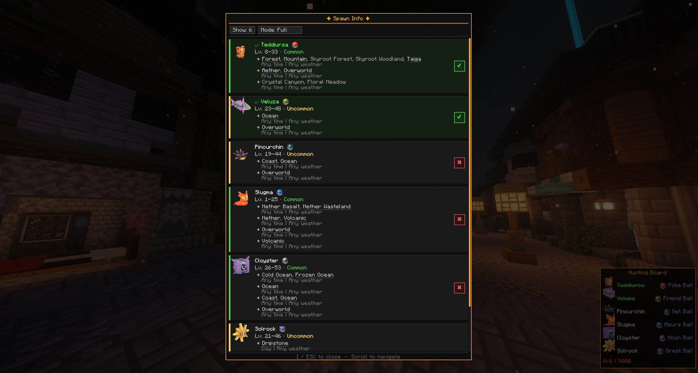
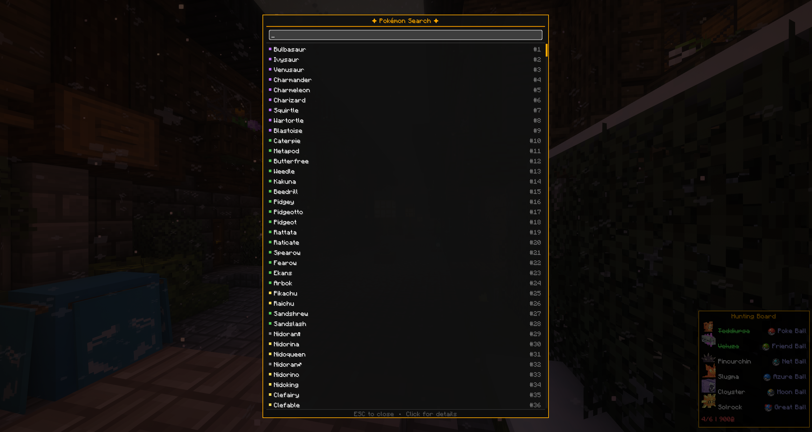
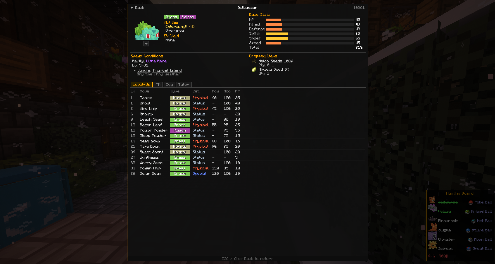

# HunterBoard

Mod client Fabric pour Minecraft 1.21.1 qui ajoute un overlay HUD pour le tableau de chasses de Tropimon et [Cobblemon](https://cobblemon.com/).

Le mod lit automatiquement les chasses depuis le tableau (TropimodClient) et affiche en permanence sur ton ecran les Pokemon a capturer avec la ball demandee, les infos de spawn, et la validation auto quand tu completes une chasse.

## Fonctionnalites

### HUD en jeu
- Affichage permanent des chasses en cours avec le **modele 3D** de chaque Pokemon, son nom et la ball requise
- 4 modes d'affichage : Full, Compact, Minimal, Icon
- Masquable avec la touche **B**

### Ecran d'infos (touche I)
- Carte detaillee pour chaque Pokemon de la chasse : tier, reward, ball requise
- **Donnees de spawn** : biomes, horaires, meteo, niveaux, rarete — chargees directement depuis les fichiers de Cobblemon (fonctionne aussi sur serveur)
- Modele 3D du Pokemon sur chaque carte
- **Bouton de validation manuelle** sur chaque carte (check vert / croix rouge) pour marquer un Pokemon comme capture ou non

### Recherche de Pokemon (touche O)
- Recherche parmi tous les Pokemon de Cobblemon par nom
- Indicateur de rarete (common, uncommon, rare, ultra-rare)
- Clic sur un Pokemon pour voir sa fiche complete

### Fiche Pokemon
- Vue detaillee d'un Pokemon accessible depuis la recherche
- Tous les spawns possibles avec biomes, conditions meteo, horaires et niveaux

### Detection auto des captures
- Detection via le **party** : quand un nouveau Pokemon est attrapé avec la bonne ball, la chasse se valide automatiquement (Singleplayer only)
- Validation manuelle via l'ecran d'infos

## Installation

1. Jouer avec le modpack Tropimon (Modrinth ou Launcher officiel)
2. Mettre le `.jar` de HunterBoard dans le dossier `mods/`

## Touches

| Touche | Action |
|--------|--------|
| **B** | Afficher / masquer le HUD |
| **I** | Ouvrir l'ecran d'infos des chasses |
| **O** | Ouvrir la recherche de Pokemon |

Les touches sont reconfigurables dans les options de Minecraft (Controles > HunterBoard).
